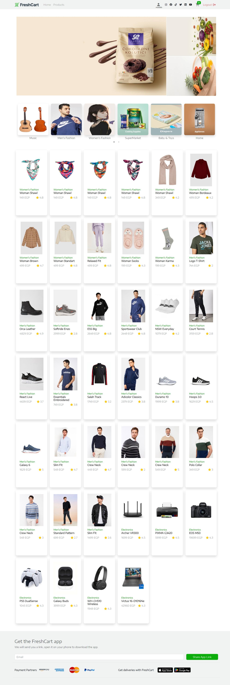
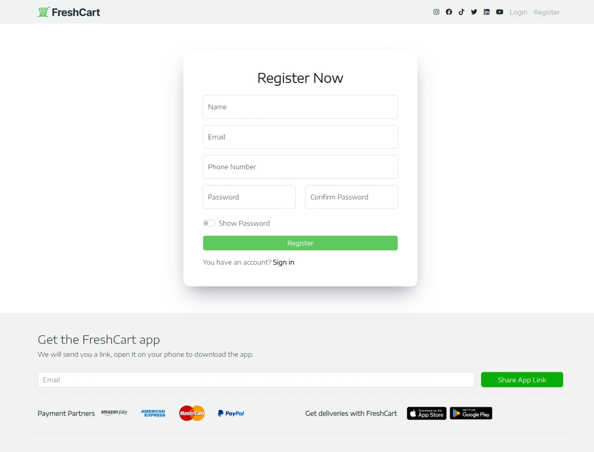
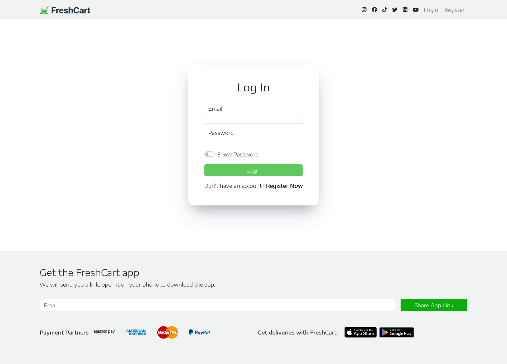
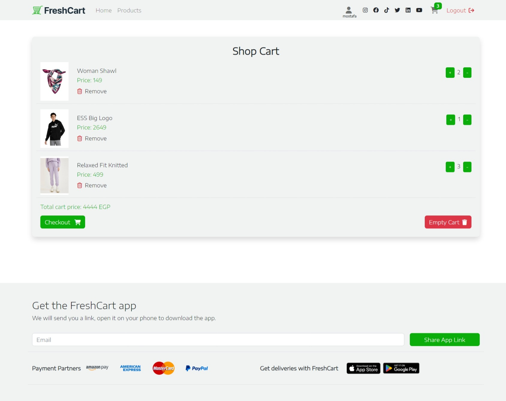
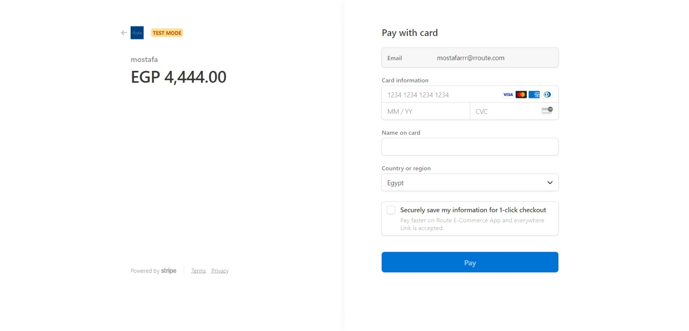
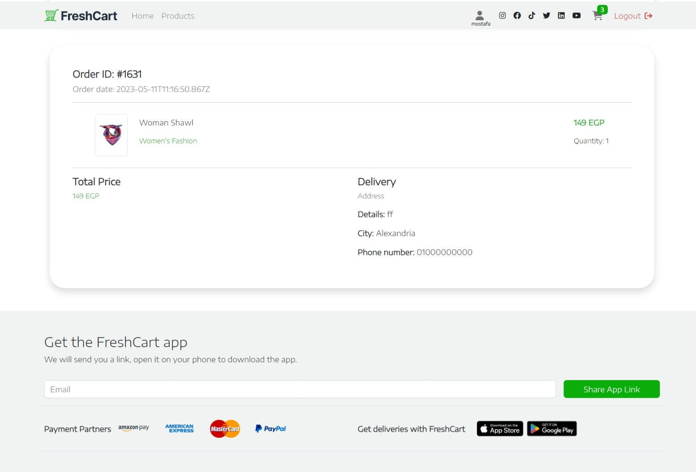
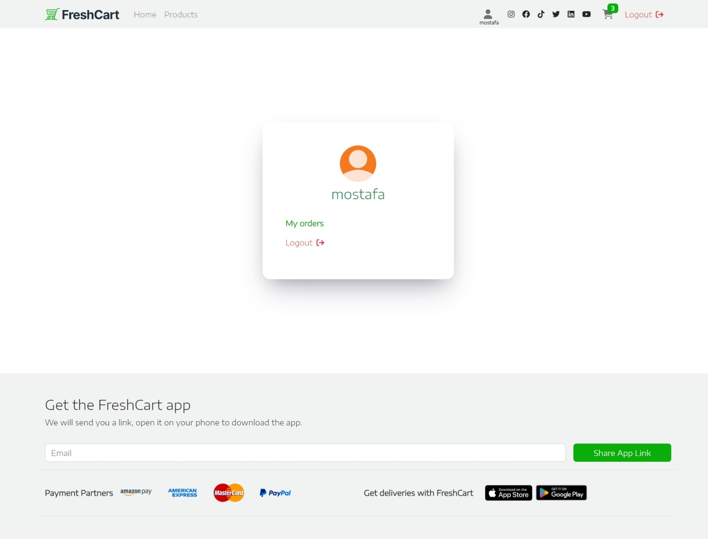

# E-Commerce (ReactJs)

This is my work assigned by [Route-Academy](https://www.linkedin.com/company/routeacademy/mycompany/) during learning front-end web development.

## Table of contents

- [Screenshot](#screenshot)
- [Links](#links)
- [Scripts](#scripts)
- [Author](#author)

    

    
    

    

    
    
    
    
    
    
    

<!--  -->

### Links

- Solution URL: [Code](https://github.com/IMostafaR/e-commerce-react-app)
- Live app URL: [Code](https://imostafar.github.io/e-commerce-react-app/)

## Scripts

In the project directory, you can run:

### `npm install`

Download all project dependencies

### `npm start`

Runs the app in the development mode.\
Open [http://localhost:3000](http://localhost:3000) to view it in your browser.

The page will reload when you make changes.\
You may also see any lint errors in the console.

## Author

- GitHub - [IMostafaR](https://github.com/IMostafaR)
- Linkedin - [@imostafarh](https://www.linkedin.com/in/imostafarh/)
